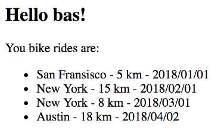

# Exercise 03

- Deploy a Flask API in a Docker container
- The Flask API code is in this folder
- Write the Dockerfile to create the Docker image
- Success once you see this:
  
- Then try this: (browse to `localhost:8080?name=bas`)
  

Fill in the Dockerfile to:
- retrieve an image (recommended: `python:3.10-slim`)
- specify `app` as work directory
- copy the files into the `app` folder
- install python packages defined in requirements.txt
- expose port 5000
- entry point should be python
- command should be app.py