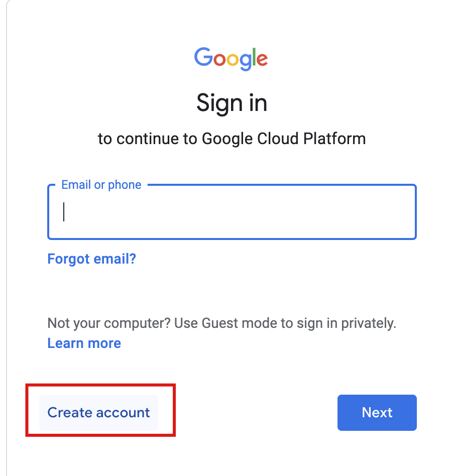

# VodafoneZiggo Docker and Kubernetes training

# 📄 Details

The course will be held on 17,18 and October at VodafoneZiggo, (Boven Vredenburgpassage 128, Utrecht) and will run from 09:00 - 17:00

The schedule will be roughly as follows, depending on the pace that we're able to go:
- Day 1 AM: Intro, Docker theory, Docker CLI, Dockerfile
- Day 1 PM: Docker Compose, CI/CD, Kubernetes intro 
- Day 2 AM: Kubernetes core concepts and configuration
- Day 2 PM: Kubernetes observability, pod design, services and networking
- Day 3 AM: Kubernetes state persistence and buffer period
- Day 3 PM: Hackathon or DeepDive into kubernetes templating tool (Helm)

Each portion of the course will also include exercises to be completed by the participants

# Slides

PDFs of the slides are available in the `01_docker` or `02_kubernetes` folders (will be available at the end of the course)

# 🛠 Setup

Below we include the setup for both the Docker and the Kubernetes portions of the training.
Most important is that you will need to setup a Google Cloud Platform account and then forward the mail used for that account to paolo.radaelli@xebia.com before 23 May.  You can do that by going to [this](https://accounts.google.com/signup/v2/webcreateaccount?biz=false&cc=NL&continue=https%3A%2F%2Fconsole.cloud.google.com%2Ffreetrial%3Ffacet_utm_source%3D01%26facet_utm_campaign%3D01%26facet_utm_medium%3D01%26facet_url%3Dhttps%3A%2F%2Fcloud.google.com%26facet_id_list%3D%255B39300013%2C%2B39300022%2C%2B39300118%2C%2B39300192%2C%2B39300196%2C%2B39300251%2C%2B39300318%2C%2B39300320%2C%2B39300324%2C%2B39300333%2C%2B39300346%2C%2B39300354%2C%2B39300363%2C%2B39300374%2C%2B39300412%2C%2B39300421%2C%2B39300436%2C%2B39300472%255D&dsh=S-939270895%3A1675877960993536&flowEntry=SignUp&flowName=GlifWebSignIn&followup=https%3A%2F%2Fconsole.cloud.google.com%2Ffreetrial%3Ffacet_utm_source%3D01%26facet_utm_campaign%3D01%26facet_utm_medium%3D01%26facet_url%3Dhttps%3A%2F%2Fcloud.google.com%26facet_id_list%3D%255B39300013%2C%2B39300022%2C%2B39300118%2C%2B39300192%2C%2B39300196%2C%2B39300251%2C%2B39300318%2C%2B39300320%2C%2B39300324%2C%2B39300333%2C%2B39300346%2C%2B39300354%2C%2B39300363%2C%2B39300374%2C%2B39300412%2C%2B39300421%2C%2B39300436%2C%2B39300472%255D&ifkv=AWnogHdweHdkqT8q02neDVHDKTmRcQnQMJkFWqfj8AL9u5JM2nggIgj3CLkDFckuVl8ZtLXgTU7vrA&osid=1&service=cloudconsole&nogm=true) page.  

## Docker

For Docker setup, there are two options:

- use of a local setup
- use of Google Cloud Shell

Should you have any issues with local setup, the use of Google Cloud Shell is recommended.  Instructions for both can be found below.

### Local Setup

The setup requirements are as follows:

- a running instance of Docker, installation instructions [here](https://docs.docker.com/get-docker/)
- a code editor like VS Code or IntelliJ
- [git](https://git-scm.com/book/en/v2/Getting-Started-Installing-Git) (for cloning the exercise code)

### Google Cloud Shell

Google Cloud Shell provides a cloud version of VS Code with access to all required Docker tooling

Setup instructions are as follows:

1. Ensure you have a Google account (if you have Gmail you already have one 😄)

2. Go to https://console.cloud.google.com

3. Select "Activate Cloud Shell"

   

4. Select Open editor

   

5. Select Open in New Window

You should now be able to see a code editor environment much like VS Code.  To access a terminal, select "Terminal"->"New Terminal"

>  Note that if your browser uses cookie blockers like UBlock Origin, you may need to disable them.

Important to note is that your Cloud Shell instance will be put to sleep after 20 minutes of inactivity.  Starting it back up again takes a few seconds.

## Kubernetes

For the Kubernetes part of the training we will make use of clusters in Google Cloud Platform (GCP).  These clusters will be provisioned by the trainers.  To make use of these clusters, you will need to setup a Google Cloud Platform account.  

If you already have a Gmail account you're set 👍, you can just use your Gmail address! If you'd prefer not to use a Gmail account, see instructions below.

⚡️Please forward the email address linked to your account to paolo.radaelli@xebia.com before 23 May so that we can ensure access to the cluster is configured.

To link to your cluster you have two options:

- setup `gcloud` on your local machine; or
- use Google Cloud Shell as detailed above in the Docker setup instructions

### Setup `gcloud` on your local machine

1. Install `gcloud` for your particular platform: https://cloud.google.com/sdk/docs/install
2. Link to your Google Cloud Platform account by running `gcloud auth login`
3. Install `kubectl` , instructions: [here](https://cloud.google.com/kubernetes-engine/docs/how-to/cluster-access-for-kubectl#install_kubectl)
> Note: If you already have kubectl you can skip this step but you'll still need to install the plugin in the next step
4. Install the required `gke-gcloud-auth-plugin`, instructions [here](https://cloud.google.com/kubernetes-engine/docs/how-to/cluster-access-for-kubectl#install_plugin)

> If you encounter any issues following these steps, not to worry, we will go through them again during the training

### Setting up a Google Cloud Platform account for a non-Gmail email address

*Note that this is only if you want to create an account linked to a non Gmail email address*

To do this, go to https://accounts.google.com and select "Create account"

Then fill in the additional details, specifying your preferred email address.

# ⚠️ Any issues encountered?

If you encounter any issues or have questions, feel free to mail paolo.radaelli@xebia.com.

